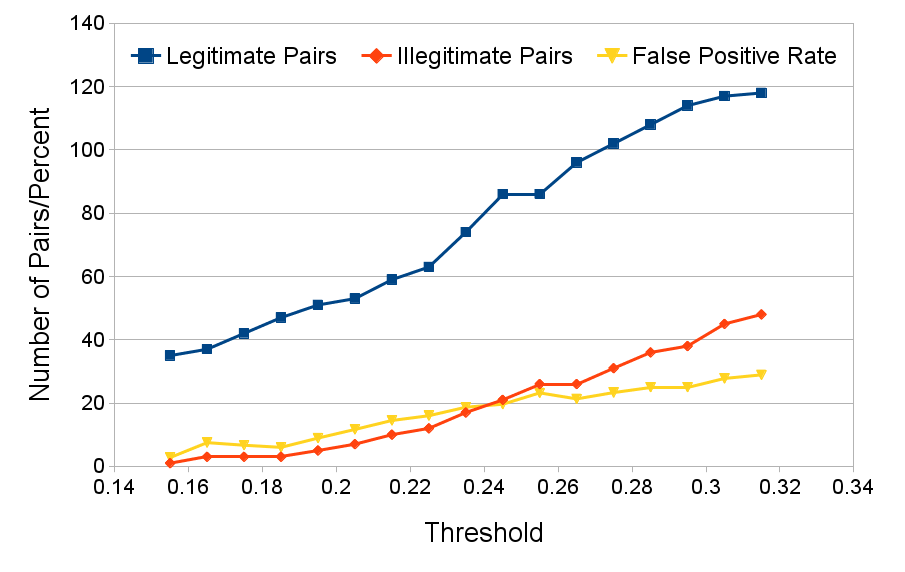

# Title Slide

Any text under a header 1 won't be shown. This is a title slide without
content!





<!-- Leave the alternative text empty and add a backslash *plus a trailing space
or an extra newline* to get no image caption at all -->
\


## Content Slide

Do math simply!

$$\sqrt{5} \neq 1$$

`Use` standard *markdown* **easily**.

### With Lower Level Headers

```python
def some_code(is_easy_to):
    integrate()

# With syntax highlighting, of course!
```

## Incrementally Showing Lists

<!-- Use > to make lists show incrementally. Oh you noticed?
     This is a comment! -->
> - Is
> - Dead
> - Easy!

# Compiling

## Compiling

# Bibliography

## Citation example

See @hiermann2016electric.

## Referencias

<!-- Simply use `make pandoc` in this directory! -->
